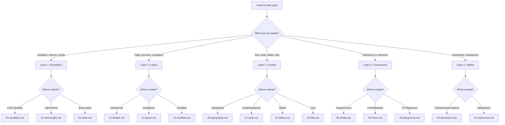

# CSS Architecture Skill

**Purpose:** Educational guidance for working with the AIGENSA Vibe Coding Course's modular CSS system. This skill provides decision trees, workflows, and best practices for maintaining the 5-layer architecture.

**Type:** Guidance-focused (no automation)

---

## Overview

The AIGENSA Vibe Coding Course uses a **modular CSS architecture** organized into 5 distinct layers. This architecture replaces the previous monolithic 1,216-line `styles.css` with 15 focused modules totaling ~28KB source (~19KB minified).

### Why Layered Architecture?

**Benefits:**
- **Predictable cascade:** Variables load before usage, preventing undefined property errors
- **Clear responsibility:** Each layer has a specific purpose, reducing decision paralysis
- **Maintainable:** Modules stay focused (50-150 lines), easier to understand and modify
- **Scalable:** New modules can be added without disrupting existing styles
- **Theme-aware:** Dark/light themes managed through CSS custom properties

**Build Process:**
1. `css-modules.json` defines module order
2. `asset-builder.ts` concatenates modules sequentially
3. `lightningcss` minifies the result → `output/styles.css`

**Key Principle:** Module order matters. Variables must load before usage. Never reorder without understanding dependencies.

---

## Quick Start: Where Does My Style Go?

Use this decision tree to identify the correct layer for your styles:



---

## Documentation Structure

This skill is organized into focused guides:

### Core Guides

**1. The 5 Layers Guide**
@.claude/skills/css-architecture/layers-guide.md
Understanding each layer's purpose, responsibility, and when to extend vs. create new modules.

**2. Common Workflows**
@.claude/skills/css-architecture/workflows.md
Step-by-step guided workflows for 7 common tasks: adding styles, creating components, fixing errors, etc.

**3. Build & Validation**
@.claude/skills/css-architecture/build-validation.md
How the build system works, npm scripts, pre-commit hooks, CI validation, and stylelint rules.

**4. Decision Trees**
@.claude/skills/css-architecture/decision-trees.md
Visual flowcharts to help you decide: Which layer? New module or extend? Variable or hard-coded?

**5. Patterns & Conventions**
@.claude/skills/css-architecture/patterns.md
CSS variable naming, class naming patterns, GSAP animations, theme mapping, spacing/shadow usage.

**6. Troubleshooting**
@.claude/skills/css-architecture/troubleshooting.md
Solutions for common issues: styles not applying, theme switching problems, validation errors, performance.

**7. Architecture FAQ**
@.claude/skills/css-architecture/faq.md
Frequently asked questions about the 5-layer architecture, module ordering, and design decisions.

### Reference Materials

**Variable Conventions**
@.claude/skills/css-architecture/references/variable-conventions.md
CSS variable naming strategies, primitive vs. semantic variables, and the design token system.

**Common Fixes**
@.claude/skills/css-architecture/references/common-fixes.md
Solutions for 15+ common stylelint errors and CSS issues with before/after examples.

**Responsive Breakpoints**
@.claude/skills/css-architecture/references/responsive-breakpoints.md
Mobile-first approach, breakpoint values, and responsive patterns for the course site.

**Theme System**
@.claude/skills/css-architecture/references/theme-system.md
How dark/light theme switching works, adding theme variables, and testing theme changes.

---

## Quick Reference: File Structure

```
src/styles/
├── css-modules.json          # Build manifest (module order)
├── README.md                 # Architecture documentation
│
├── Layer 1: Foundation
│   ├── 00-variables.css      # CSS custom properties
│   ├── 01-theme-light.css    # Light theme overrides
│   └── 02-reset.css          # CSS reset, base styles
│
├── Layer 2: Layout
│   ├── 10-header.css         # Navigation header
│   ├── 11-layout.css         # Grid system
│   └── 12-scrollbar.css      # Custom scrollbars
│
├── Layer 3: Content
│   ├── 20-typography.css     # Headings, paragraphs
│   ├── 21-code.css           # Code blocks, quotes
│   ├── 22-tables.css         # Table styling
│   └── 23-lists.css          # Lists, markers
│
├── Layer 4: Components
│   ├── 30-media.css          # Images, charts
│   ├── 31-forms.css          # Forms, buttons
│   └── 32-playground.css     # AI Playground
│
└── Layer 5: Utilities
    ├── 40-animations.css     # Animations, transitions
    └── 41-responsive.css     # Media queries
```

---

## Key npm Commands

```bash
# Linting
npm run lint:css           # Check for CSS errors
npm run lint:css:fix       # Auto-fix issues

# Building
npm run build              # Build HTML + CSS
npm run dev                # Watch mode (auto-rebuild)

# Testing
npm run test               # Run all tests
npm run test:charts        # Test charts only
```

---

## Critical Files Reference

- **Architecture docs:** `src/styles/README.md`
- **Build manifest:** `src/styles/css-modules.json`
- **Build script:** `src/builders/asset-builder.ts`
- **Lint config:** `.stylelintrc.json`
- **Variables:** `src/styles/00-variables.css`

---

## Getting Started

1. **Read the layers guide** to understand the architecture
2. **Use decision trees** when adding new styles
3. **Follow workflows** for common tasks
4. **Validate often** with `npm run lint:css`
5. **Test themes** by toggling dark/light mode
6. **Refer to troubleshooting** when issues arise

---

## Conclusion

This skill provides comprehensive guidance for working with the modular CSS system. Use the decision trees, workflows, and reference materials to confidently add, modify, and validate styles while maintaining the 5-layer architecture.

**Key principles:**
- Each layer has a specific responsibility
- Module order determines cascade (variables first!)
- Use CSS variables for consistency and theme support
- Keep modules focused (<200 lines)
- Validate early and often
- Test theme switching for all changes

**Happy styling! 🎨**
