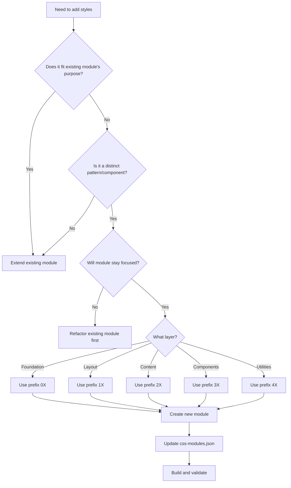
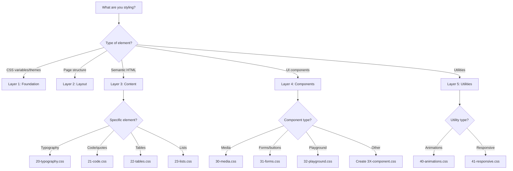
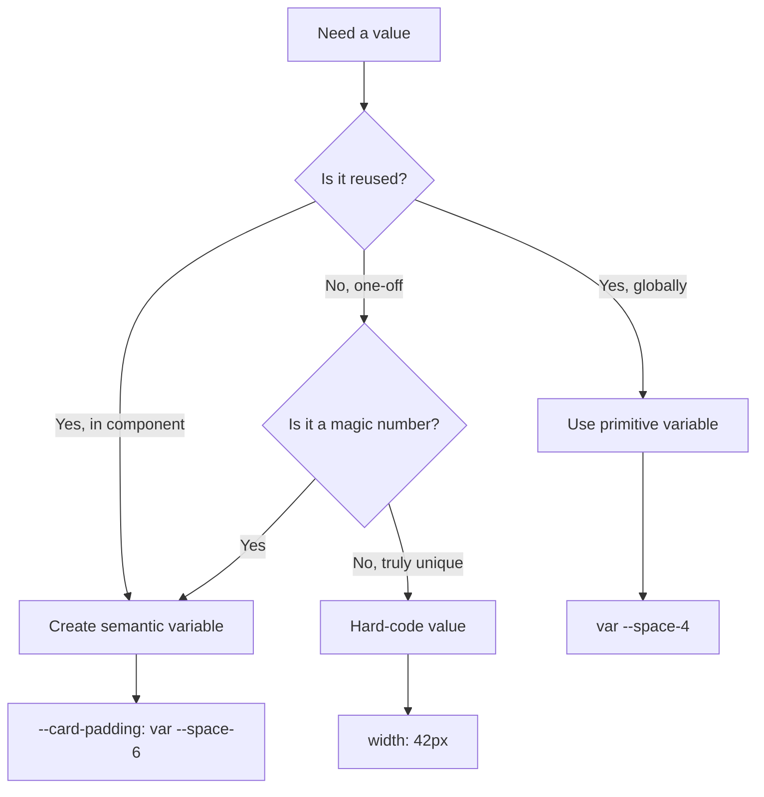
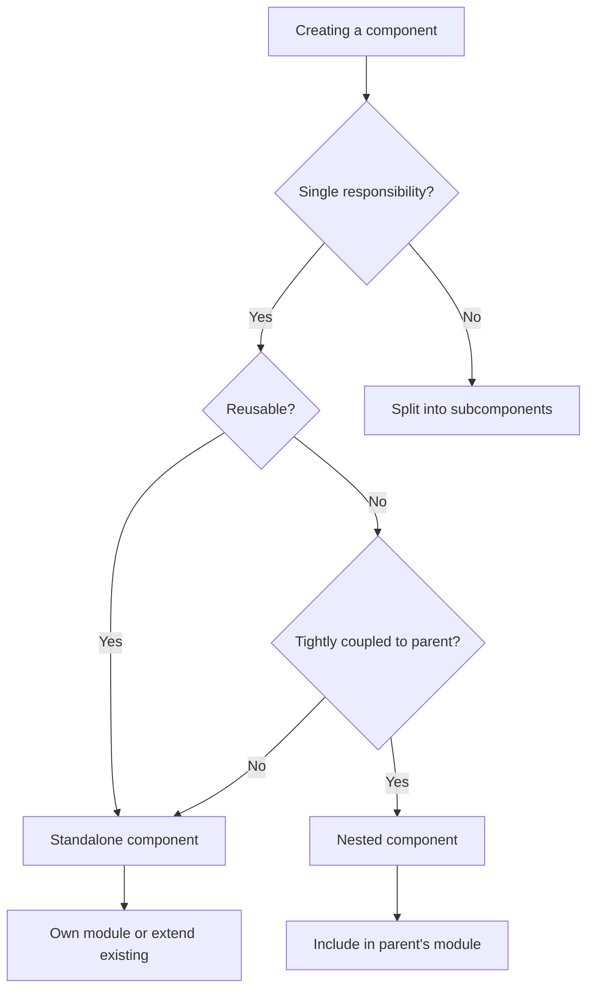
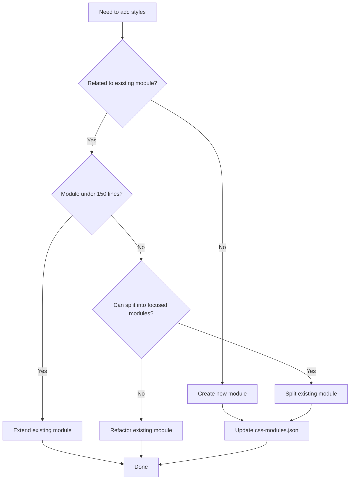
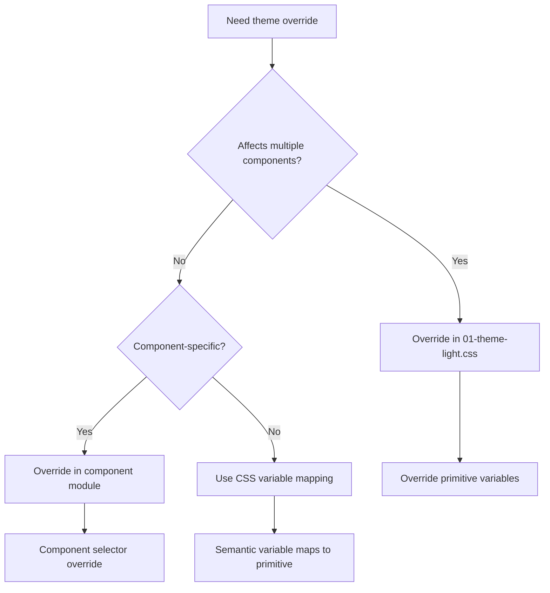
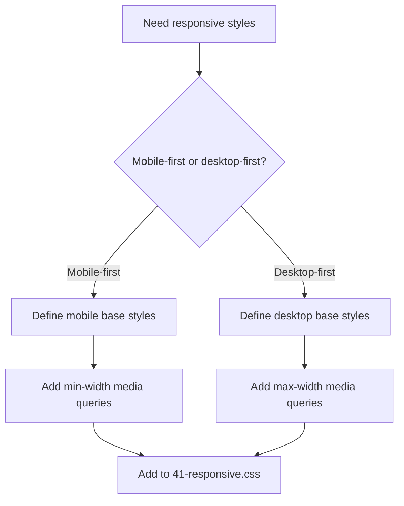

# Decision Trees

Visual flowcharts to help you make CSS architecture decisions.

---

## Should I Create a New Module?



### Decision Guidelines

**Extend existing module if:**
- Styles fit existing module's responsibility
- Module stays under 200 lines after adding
- Related to existing patterns in module

**Create new module if:**
- Distinct pattern/component (modals, cards, tabs)
- Existing module would exceed 200 lines
- Unrelated to existing module's purpose

**Refactor first if:**
- Existing module is too large (>200 lines)
- Module has multiple responsibilities
- Adding would make it harder to maintain

---

## Which Layer for My Styles?



### Layer Decision Questions

Ask yourself these questions in order:

**1. Am I defining design tokens?**
- Colors, spacing, typography scales, shadows
- → Layer 1 (Foundation) - `00-variables.css`

**2. Am I creating theme overrides?**
- Light theme color mappings
- → Layer 1 (Foundation) - `01-theme-light.css`

**3. Am I structuring the page layout?**
- Header, footer, sidebar, grid system
- → Layer 2 (Layout) - `1X-*.css`

**4. Am I styling semantic HTML tags?**
- h1-h6, p, a, ul, ol, table, pre, code
- → Layer 3 (Content) - `2X-*.css`

**5. Am I building an interactive component?**
- Buttons, forms, cards, modals, tabs
- → Layer 4 (Components) - `3X-*.css`

**6. Am I adding animations or responsive styles?**
- Keyframes, transitions, media queries
- → Layer 5 (Utilities) - `4X-*.css`

---

## Variable vs. Hard-Coded Value?



### Variable Type Guidelines

**Primitive variable (Layer 1):**
- Used across multiple components
- Part of design system (colors, spacing, shadows)
- Examples: `--gray-7`, `--space-4`, `--radius-md`

**Semantic variable (Component-specific):**
- Used within a single component
- Describes purpose, not value
- Maps to primitive
- Examples: `--card-padding`, `--button-bg`, `--border-color`

**Hard-coded value:**
- Truly unique (e.g., logo width, specific dimension)
- Not part of design system
- One-off usage
- Examples: `width: 42px` (specific logo size)

### Examples

**Good: Using primitive variables**
```css
.card {
  padding: var(--space-6);
  border-radius: var(--radius-md);
  box-shadow: var(--shadow-md);
}
```

**Good: Using semantic variables**
```css
.card {
  --card-padding: var(--space-6);
  --card-border-radius: var(--radius-md);

  padding: var(--card-padding);
  border-radius: var(--card-border-radius);
}
```

**Bad: Hard-coded magic numbers**
```css
.card {
  padding: 24px; /* What does 24 mean? Why not 20 or 28? */
  border-radius: 6px; /* Magic number */
}
```

**Acceptable: Truly unique hard-coded value**
```css
.logo {
  width: 42px; /* Specific logo dimension, not part of system */
}
```

---

## Component Scope Decision



### Component Scope Guidelines

**Standalone component:**
- Reusable across multiple contexts
- Has own module or extends existing
- Examples: buttons, cards, modals

**Nested component:**
- Tightly coupled to parent component
- Only used within specific context
- Included in parent's module
- Examples: `.card-header` within `.card`, `.playground-controls` within `.chutes-playground`

### Examples

**Standalone component:**
```css
/* 33-cards.css */
.card {
  /* Reusable card pattern */
  background: var(--bg-secondary);
  border: 1px solid var(--border-color);
  border-radius: var(--radius-md);
  padding: var(--space-6);
}
```

**Nested component:**
```css
/* 32-playground.css */
.chutes-playground {
  /* Playground container */
}

.playground-controls {
  /* Tightly coupled to playground */
  /* Only used within .chutes-playground */
}

.playground-input {
  /* Only used within playground */
}
```

---

## Extend vs. Create New Module



### Guidelines

**Extend existing module when:**
- Module is under 150 lines
- New styles fit module's responsibility
- Won't make module hard to maintain

**Create new module when:**
- Distinct pattern/component
- Existing module would exceed 200 lines
- Unrelated to existing modules

**Split module when:**
- Module exceeds 200 lines
- Multiple distinct responsibilities
- Can cleanly separate concerns

**Example split:**
```
Before: 31-forms.css (250 lines)
  - Inputs (70 lines)
  - Buttons (80 lines)
  - Checkboxes (50 lines)
  - Radio buttons (50 lines)

After:
  - 31-inputs.css (70 lines)
  - 32-buttons.css (80 lines)
  - 33-checkboxes.css (100 lines - includes radio)
```

---

## Theme Override Decision



### Theme Override Strategies

**Strategy 1: Override primitives (best for system-wide changes)**
```css
/* 01-theme-light.css */
html[data-theme="light"] {
  --gray-1: #fcfcfc; /* Inverted for light theme */
  --gray-12: #111113;
}
```
- Affects all components using these variables
- Centralized theme logic
- Preferred approach

**Strategy 2: Component-specific override**
```css
/* 33-cards.css */
[data-theme="light"] .card {
  background: var(--gray-1);
  box-shadow: var(--shadow-sm);
}
```
- Overrides specific component
- Use when component needs special treatment in light theme
- Keep in component's module for maintainability

**Strategy 3: Semantic variable mapping (most flexible)**
```css
/* 00-variables.css */
:root {
  --bg-primary: var(--gray-2);
  --bg-secondary: var(--gray-3);
}

/* 01-theme-light.css */
html[data-theme="light"] {
  --gray-2: #f5f5f5; /* Primitive changes */
  --gray-3: #eeeeee;
  /* Semantic variables automatically adapt */
}
```
- Semantic variables automatically adapt to theme
- Preferred for components
- Minimal theme-specific code

---

## Responsive Strategy Decision



### Mobile-First Approach (Recommended)

**Base styles (mobile):**
```css
/* 33-cards.css */
.card-grid {
  display: grid;
  grid-template-columns: 1fr; /* Mobile: single column */
  gap: var(--space-4);
}
```

**Progressive enhancement (larger screens):**
```css
/* 41-responsive.css */
@media (width >= 768px) {
  .card-grid {
    grid-template-columns: repeat(2, 1fr); /* Tablet: 2 columns */
  }
}

@media (width >= 1024px) {
  .card-grid {
    grid-template-columns: repeat(3, 1fr); /* Desktop: 3 columns */
  }
}
```

**Benefits:**
- Simpler mobile styles (less overrides)
- Better mobile performance
- Progressive enhancement philosophy

### Desktop-First Approach (Legacy)

**Base styles (desktop):**
```css
/* 33-cards.css */
.card-grid {
  display: grid;
  grid-template-columns: repeat(3, 1fr); /* Desktop: 3 columns */
  gap: var(--space-6);
}
```

**Overrides for smaller screens:**
```css
/* 41-responsive.css */
@media (width <= 1024px) {
  .card-grid {
    grid-template-columns: repeat(2, 1fr); /* Tablet: 2 columns */
  }
}

@media (width <= 768px) {
  .card-grid {
    grid-template-columns: 1fr; /* Mobile: single column */
    gap: var(--space-4);
  }
}
```

**Drawbacks:**
- More complex mobile styles (many overrides)
- Worse mobile performance (loading unnecessary styles)
- Not recommended for new code

---

## Summary: Quick Decision Reference

| Decision | Questions to Ask | Outcome |
|----------|------------------|---------|
| **Which layer?** | Design tokens? Layout? Semantic HTML? Component? Utility? | Layer 1-5 |
| **New module?** | Fits existing? Distinct? Module size? | Extend or create |
| **Variable type?** | Reused globally? Component-specific? One-off? | Primitive, semantic, or hard-code |
| **Component scope?** | Reusable? Tightly coupled? | Standalone or nested |
| **Theme override?** | System-wide? Component-specific? | Global, local, or semantic mapping |
| **Responsive?** | Mobile-first? Desktop-first? | Base + enhancement, or base + overrides |

Use these decision trees whenever you're unsure where CSS should go or how to structure it.
