# Mermaid Diagram Generator

## Overview

This skill generates production-ready Mermaid diagrams for the AIGENSA Vibe Coding Course that automatically adapt to light/dark theme switching.

**Core Principle:** No inline styles required. All diagrams inherit theme colors from `src/mermaid-config.js`.

**Interactive Features:**
- Zoom and pan via `src/mermaid-zoom.js`
- Click to explore nested details
- Touch-friendly controls
- Keyboard navigation support

## Theme System

### Color Configuration

The project uses `src/mermaid-config.js` with two theme configurations:

**Dark Theme Colors** (default):
```javascript
// Primary brand colors (cyan/turquoise)
primaryColor: '#00FFB8'        // Bright cyan - main nodes
primaryBorderColor: '#33FFC5'  // Lighter cyan - borders
lineColor: '#66FFD2'           // Pale cyan - connecting lines

// Background colors
background: '#18181b'          // Very dark gray
mainBkg: '#1f1f23'            // Dark slate - node fills
secondaryColor: '#1e293b'     // Slate - secondary nodes

// Node styling
nodeBorder: '#33FFC5'         // Cyan borders
titleColor: '#e2e8f0'         // Light gray text
```

**Light Theme Colors** (when theme switched):
```javascript
// Primary brand colors (teal for light mode)
primaryColor: '#0d9488'        // Teal - main nodes
primaryBorderColor: '#0f766e'  // Dark teal - borders
lineColor: '#115e59'           // Darker teal - lines

// Background colors
background: '#ffffff'          // White
mainBkg: '#f8f9fa'            // Very light gray - node fills
secondaryColor: '#f1f5f9'     // Light slate - secondary nodes

// Node styling
nodeBorder: '#0f766e'         // Teal borders
titleColor: '#0f172a'         // Very dark gray text
```

### Automatic Theme Switching

When users toggle between light/dark mode:
1. `src/theme-switcher.js` triggers theme change event
2. Mermaid re-initializes with new config from `window.getMermaidDarkConfig()` or `window.getMermaidLightConfig()`
3. All diagrams re-render with new colors
4. No code changes needed in markdown files

**Result:** Write diagrams once, they work in both themes automatically.

## Diagram Types

### 1. Flowcharts

**Best for:**
- Decision trees and conditional logic
- Workflows with multiple paths
- Process flows with branches
- Algorithm explanations

**Basic syntax:**
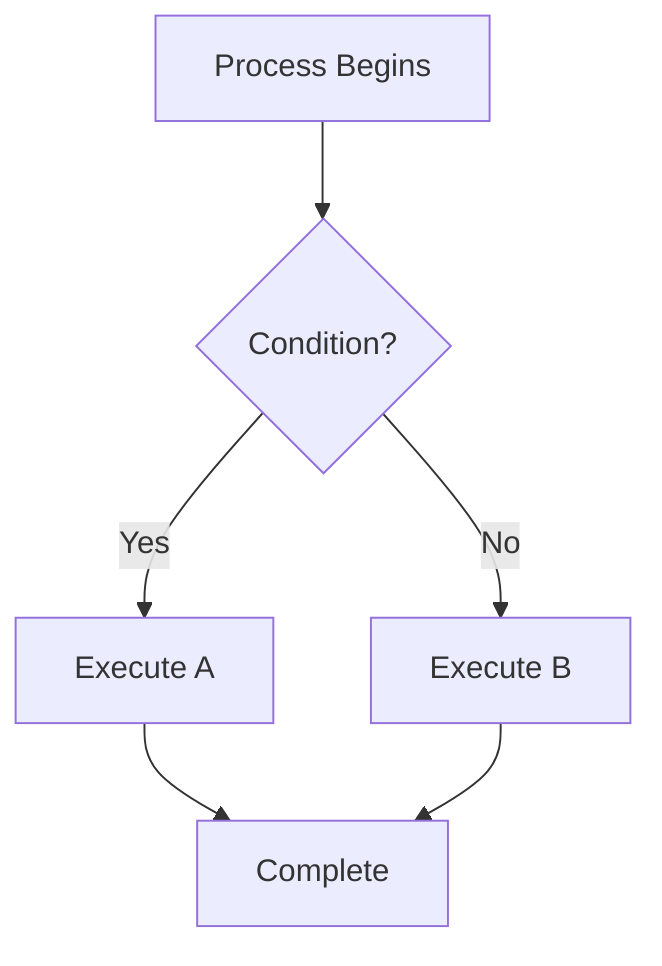

**Direction options:**
- `TD` - Top to Down (most common for processes)
- `LR` - Left to Right (for timelines)
- `BT` - Bottom to Top (rare, for build-up flows)
- `RL` - Right to Left (rare, for reverse flows)

**Node shapes:**
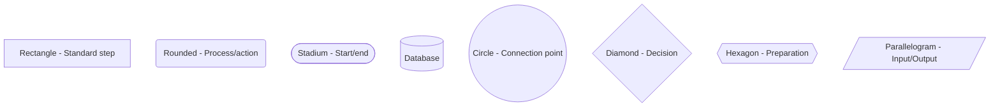

**Connection types:**
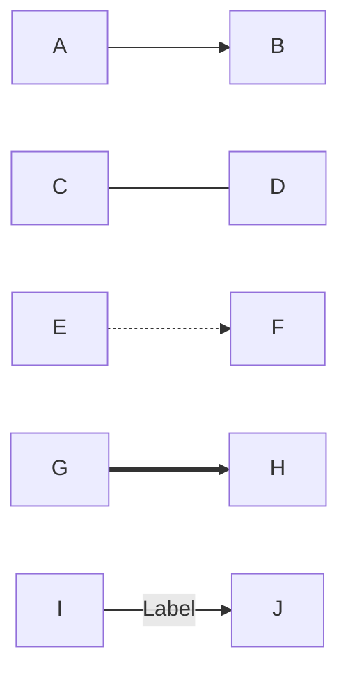

### 2. Sequence Diagrams

**Best for:**
- API interactions
- Communication between components
- Step-by-step procedures
- Request/response flows

**Basic syntax:**
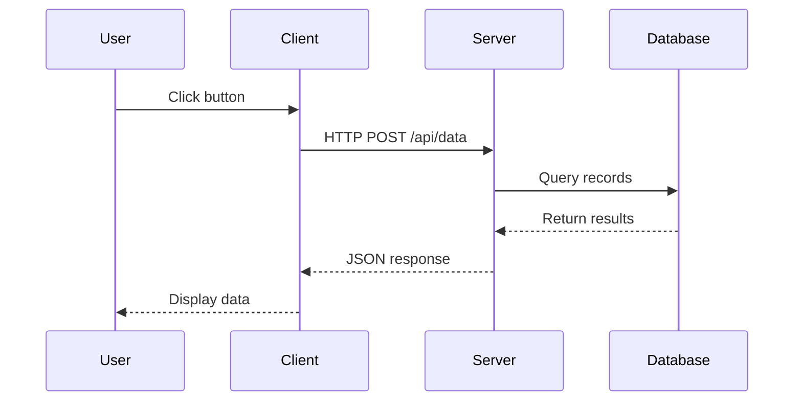

**Arrow types:**
```
->>   Solid arrow (request)
-->>  Dashed arrow (response)
-x    Cross (failed/rejected)
-)    Async message
```

**Special blocks:**
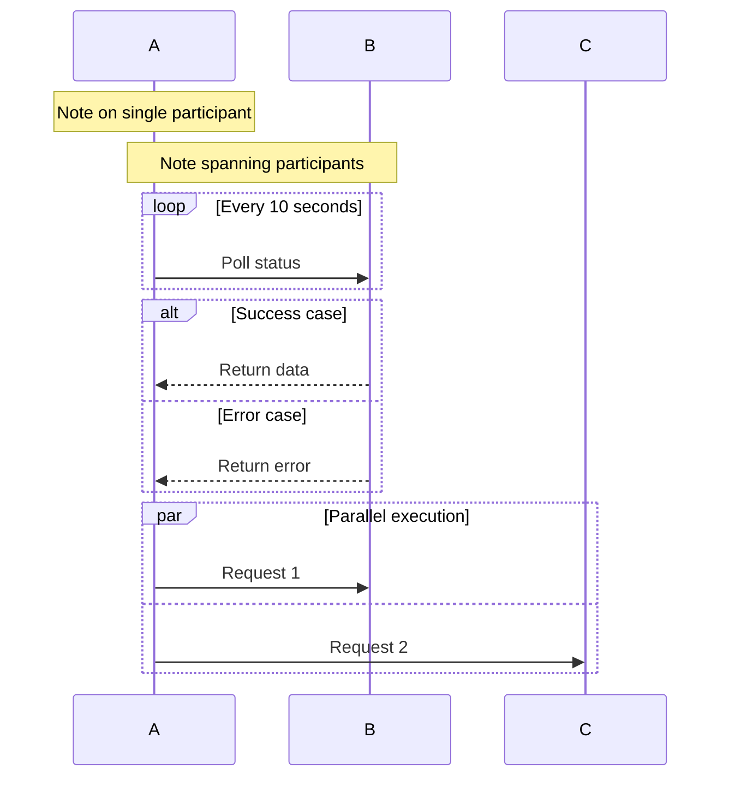

### 3. Graph Diagrams

**Best for:**
- System architectures
- Component relationships
- Network topology
- Service dependencies

**Basic syntax:**
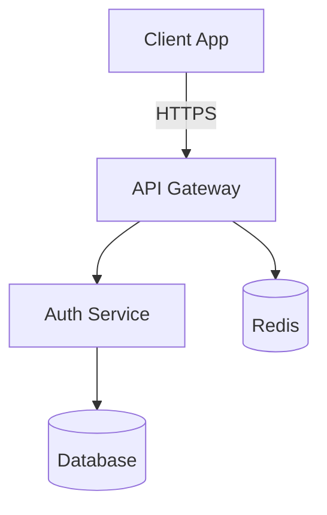

**Subgraphs (grouping related components):**
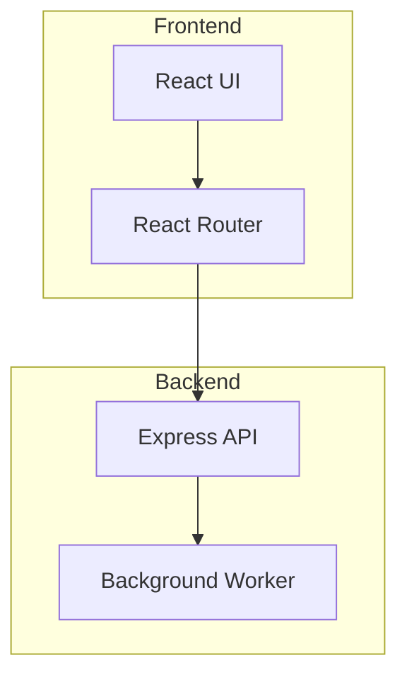

## Styling Guidelines

### DO: Let Theme Handle Colors

**✓ Correct - No inline styles:**
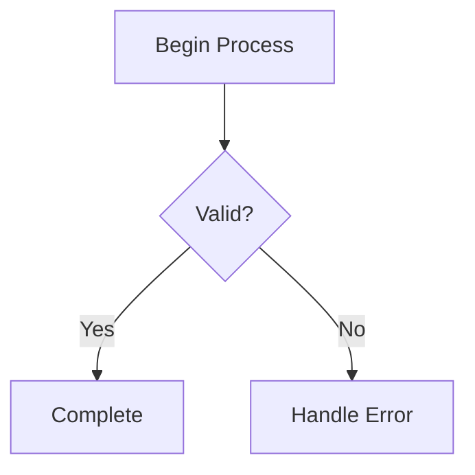

Theme automatically applies:
- Dark mode: Cyan accents (#00FFB8, #33FFC5)
- Light mode: Teal accents (#0d9488, #0f766e)
- Background colors match page theme
- Text colors have proper contrast

### DON'T: Use Inline Styles (Usually)

**✗ Avoid - Inline styling:**
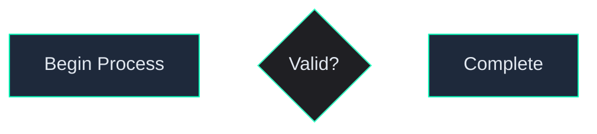

**Problems:**
- Hardcodes dark mode colors
- Breaks when theme switches to light mode
- Duplicate styling across all diagrams
- Hard to maintain

### Exception: Emphasis Styling

**When inline styles ARE appropriate:**

Use styles sparingly to emphasize specific nodes:

```mermaid
flowchart TD
    Normal1[Regular Node]
    Normal2[Regular Node]
    Important[Critical Decision]
    Error[Error State]
    Success[Success State]

    Normal1 --> Important
    Important -->|Fail| Error
    Important -->|Pass| Success
    Success --> Normal2

    style Important stroke-width:3px
    style Error fill:#4a1515,stroke:#ef4444
    style Success fill:#154a15,stroke:#22c55e
```

**Use cases for inline styles:**
- **Critical nodes** - Thicker stroke-width for important decisions
- **Error states** - Red tint (fill:#4a1515, stroke:#ef4444)
- **Success states** - Green tint (fill:#154a15, stroke:#22c55e)
- **Warning states** - Yellow tint (fill:#4a4115, stroke:#eab308)

**Rule:** Only style nodes that need to stand out. Let theme handle 90% of styling.

## Best Practices

### Keep It Simple

**Maximum complexity limits:**
- **25 nodes** - Readability threshold (beyond this, split into multiple diagrams)
- **7 levels deep** - Maximum nesting for flowcharts
- **10 interactions** - Maximum for sequence diagrams

**If diagram exceeds limits:**
```
Option 1: Split into multiple diagrams
  - "System Overview" (high-level)
  - "Component Details" (deep dive)

Option 2: Use subgraphs to group
  - Frontend components in one subgraph
  - Backend components in another

Option 3: Create hierarchical views
  - Level 1: User → System
  - Level 2: System → Services
  - Level 3: Services → Database
```

### Node Labels

**✓ Good - Concise labels:**
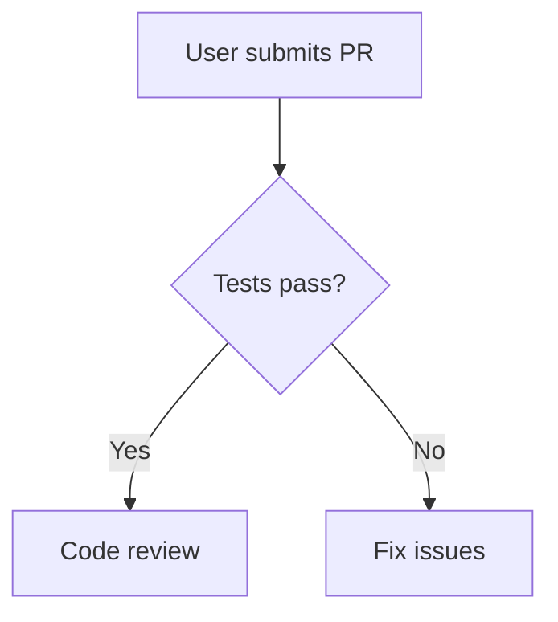

**✗ Bad - Verbose labels:**
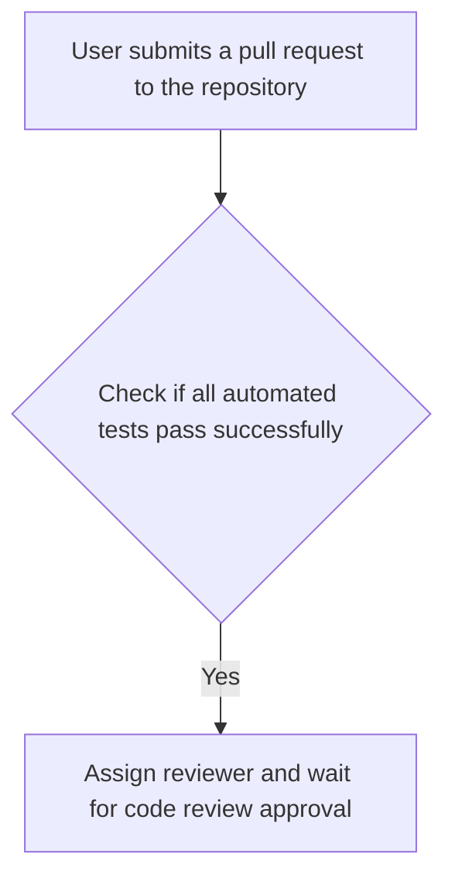

**Guidelines:**
- Maximum 4-5 words per label
- Use noun phrases for nodes ("Code Review" not "Reviewing Code")
- Use verb phrases for actions ("Fix Issues" not "Issues Fixed")
- Avoid articles (a, an, the) unless needed for clarity

### Connection Labels

**When to label connections:**
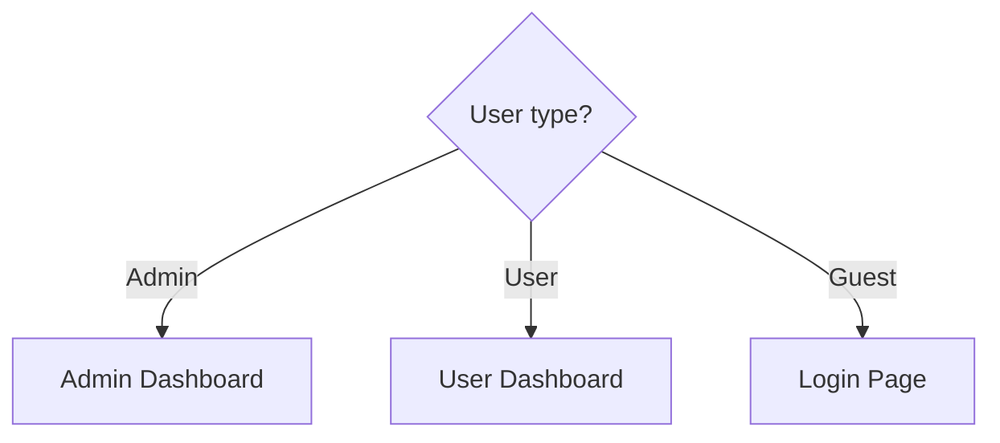

**Use connection labels when:**
- Decision branches (Yes/No, Success/Fail)
- Different user roles or permissions
- Multiple conditional paths
- HTTP methods (GET, POST, PUT, DELETE)

**Skip connection labels when:**
- Flow is sequential (one path only)
- Meaning is obvious from node labels
- Would create visual clutter

### Diagram Width

**Responsive considerations:**

Diagrams auto-scale via `mermaid-zoom.js`, but design for readability:

```
Mobile (375px):  Max 3-4 nodes wide
Tablet (768px):  Max 5-6 nodes wide
Desktop (1200px): Max 7-8 nodes wide
```

**If diagram too wide:**
```mermaid
# Instead of wide horizontal flow:
flowchart LR
    A --> B --> C --> D --> E --> F --> G --> H

# Use top-down with branching:
flowchart TD
    Start[A]
    Start --> B
    Start --> C
    B --> D
    B --> E
    C --> F
    C --> G
```

## Common Patterns

### Pattern 1: Authentication Flow

```mermaid
flowchart TD
    User[User Attempts Login] --> Validate{Credentials Valid?}
    Validate -->|No| Error[Show Error Message]
    Validate -->|Yes| MFA{MFA Enabled?}

    MFA -->|No| CreateSession[Create Session Token]
    MFA -->|Yes| VerifyMFA{MFA Code Valid?}

    VerifyMFA -->|No| Error
    VerifyMFA -->|Yes| CreateSession

    CreateSession --> Redirect[Redirect to Dashboard]
    Error --> Retry{Attempts < 3?}

    Retry -->|Yes| User
    Retry -->|No| Lock[Lock Account]

    style Validate stroke-width:3px
    style VerifyMFA stroke-width:3px
    style Lock fill:#4a1515,stroke:#ef4444
```

### Pattern 2: API Request/Response

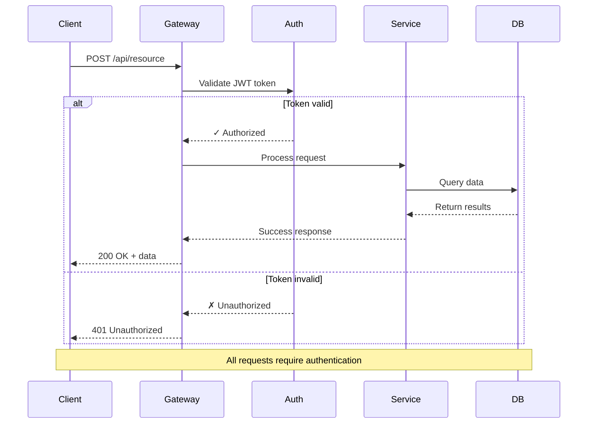

### Pattern 3: Multi-Agent Architecture

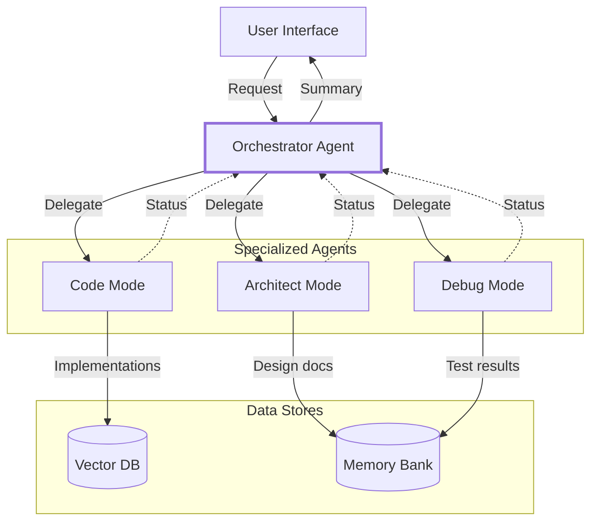

### Pattern 4: CI/CD Pipeline

```mermaid
flowchart LR
    Commit[Git Commit] --> Build{Build Success?}
    Build -->|No| NotifyFail[Notify Dev]
    Build -->|Yes| Test{Tests Pass?}

    Test -->|No| NotifyFail
    Test -->|Yes| Lint{Lint Pass?}

    Lint -->|No| NotifyFail
    Lint -->|Yes| Staging[Deploy to Staging]

    Staging --> E2E{E2E Tests Pass?}
    E2E -->|No| Rollback[Rollback Staging]
    E2E -->|Yes| Approve{Manual Approval?}

    Approve -->|No| Wait[Wait for Approval]
    Approve -->|Yes| Prod[Deploy to Production]

    Prod --> Monitor[Monitor Metrics]
    Monitor --> Complete[Pipeline Complete]

    style Build stroke-width:3px
    style Test stroke-width:3px
    style Approve stroke-width:3px
    style NotifyFail fill:#4a1515,stroke:#ef4444
    style Rollback fill:#4a4115,stroke:#eab308
    style Complete fill:#154a15,stroke:#22c55e
```

## Integration with Course Build System

### How Diagrams Render

**Build process (`src/build-html.ts`):**

1. Markdown parser encounters ` ```mermaid ` fence
2. `chartFenceRenderer()` wraps content in `<div class="mermaid">`
3. Template `src/templates/mermaid-container.eta` adds container with unique ID
4. `src/mermaid-config.js` initializes Mermaid with theme colors
5. `src/mermaid-zoom.js` adds pan/zoom controls
6. Diagram renders with theme-appropriate colors

**File references:**
```
src/build-html.ts (lines 114-121)     - Detects mermaid fences
src/templates/mermaid-container.eta   - Diagram container template
src/mermaid-config.js (lines 12-61)   - Dark theme config
src/mermaid-config.js (lines 67-116)  - Light theme config
src/mermaid-zoom.js                   - Interactive zoom/pan
src/theme-switcher.js (lines 76-97)   - Re-renders on theme change
```

### Testing Diagrams

**After creating diagram:**

1. Build the site:
   ```bash
   npm run build
   ```

2. Open in browser:
   ```bash
   open output/week_X/[filename].html
   ```

3. Verify:
   - ✓ Diagram renders correctly
   - ✓ Zoom/pan controls appear (bottom right)
   - ✓ Text is readable (contrast check)
   - ✓ Switch theme - diagram updates colors
   - ✓ Mobile view (375px width) - diagram scales appropriately

### Common Build Issues

**Issue: Diagram not rendering**
```
Cause: Invalid Mermaid syntax
Fix: Validate syntax at https://mermaid.live/
```

**Issue: Text cut off**
```
Cause: Labels too long
Fix: Shorten labels to max 4-5 words
```

**Issue: Colors don't match theme**
```
Cause: Inline styles override theme
Fix: Remove style declarations, let theme handle colors
```

**Issue: Diagram too small on mobile**
```
Cause: Too many nodes horizontally
Fix: Switch from LR to TD direction, or split into multiple diagrams
```

## Output Format

### Standard Workflow

When asked to create a Mermaid diagram:

1. **Analyze request** - What type of diagram (flowchart/sequence/graph)?
2. **Choose direction** - TD for processes, LR for timelines, TB for architectures
3. **Draft structure** - Keep under 25 nodes
4. **Use concise labels** - Max 4-5 words per node
5. **Let theme handle colors** - No inline styles unless emphasis needed
6. **Test mentally** - Would this work on mobile (375px)?

### Response Template

```markdown
Here's a [flowchart/sequence diagram/graph diagram] showing [what it represents]:

```mermaid
[diagram code]
```

**What this shows:**
- [Key insight 1]
- [Key insight 2]
- [Key insight 3]

**Interactive features:**
- Use zoom/pan controls (bottom right) to explore
- Click nodes to focus
- Switch between light/dark themes to see automatic color adaptation

**Mobile-friendly:** Diagram scales automatically for smaller screens.
```

## Examples from Course

### Existing Diagrams

**Claude Code subagents** (`content/week_2/claude-code.md`):
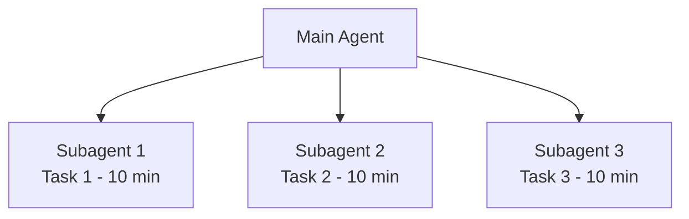

**Kilo orchestrator** (`content/week_2/kilo.md`):
```mermaid
graph TD
    User["User Request:<br/>Build email system"] --> Orch[Orchestrator]
    Orch --> ST1[Architect Mode]
    Orch --> ST2[Code Mode]
    ST1 --> Summary[Orchestrator Summary]
    ST2 --> Summary
```

**Claude Code loading** (`content/week_2/instruction-files.md`):
```mermaid
flowchart TD
    Start[Claude Code Starts] --> Discover[Scan Directory]
    Discover --> Load[Load CLAUDE.md Files]
    Load --> Process[Process @imports]
    Process --> Context[Merge into AI Context]
```

## References

### Documentation

- **Mermaid Docs:** https://mermaid.js.org/
- **Live Editor:** https://mermaid.live/ (test syntax)
- **Syntax Reference:** https://mermaid.js.org/syntax/flowchart.html

### Course Files

- **Color Config:** `src/mermaid-config.js` - Theme color definitions
- **Zoom Controls:** `src/mermaid-zoom.js` - Pan/zoom functionality
- **Theme Switcher:** `src/theme-switcher.js` - Re-render on theme change
- **Build System:** `src/build-html.ts` - Markdown fence rendering
- **Existing Examples:** `content/week_2/*.md` - Real diagram usage

### Color Palette Quick Reference

```
Dark Theme:
  Primary: #00FFB8 (cyan)
  Border: #33FFC5 (light cyan)
  Fill: #1f1f23 (dark slate)
  Text: #e2e8f0 (light gray)

Light Theme:
  Primary: #0d9488 (teal)
  Border: #0f766e (dark teal)
  Fill: #f8f9fa (very light gray)
  Text: #0f172a (very dark gray)

Emphasis Colors (use sparingly):
  Success: fill:#154a15, stroke:#22c55e (green)
  Error: fill:#4a1515, stroke:#ef4444 (red)
  Warning: fill:#4a4115, stroke:#eab308 (yellow)
```
