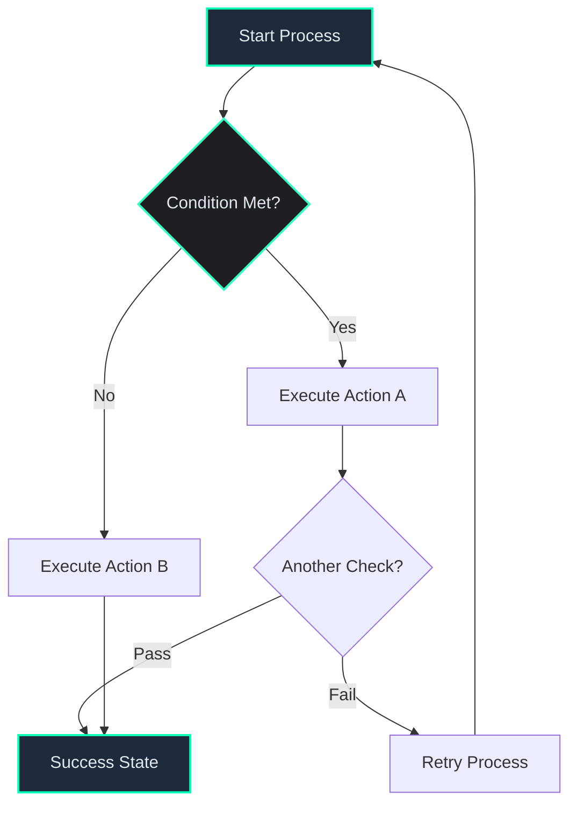
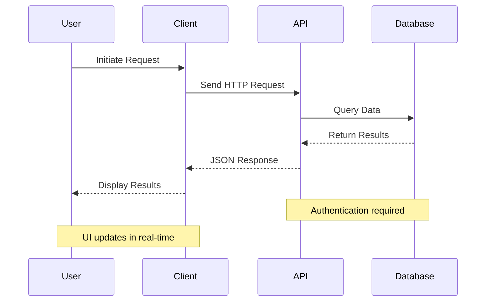
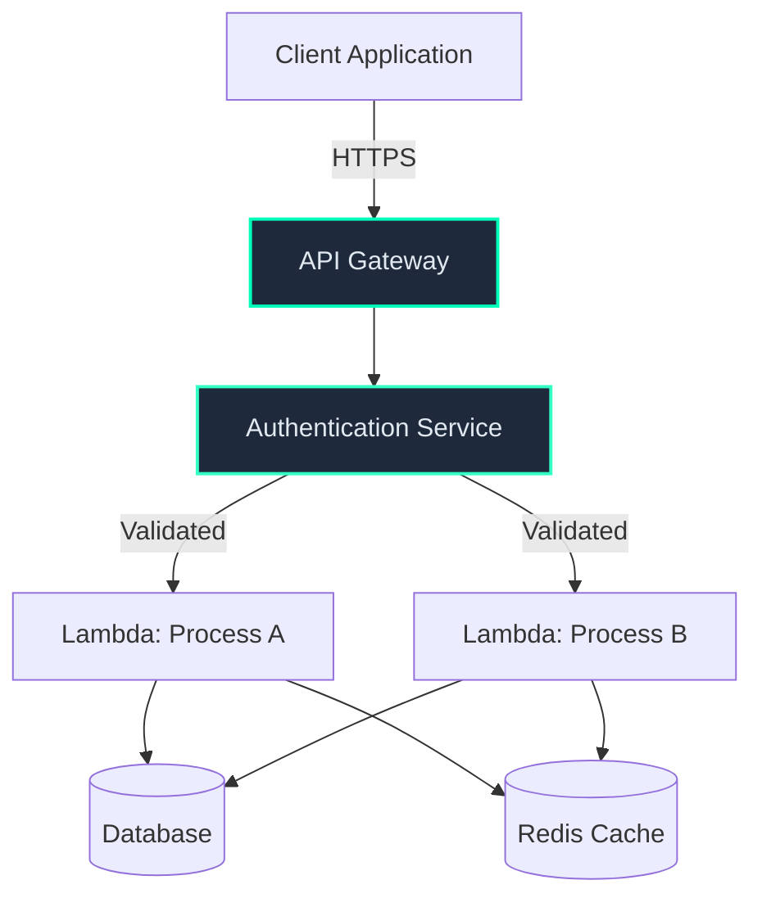
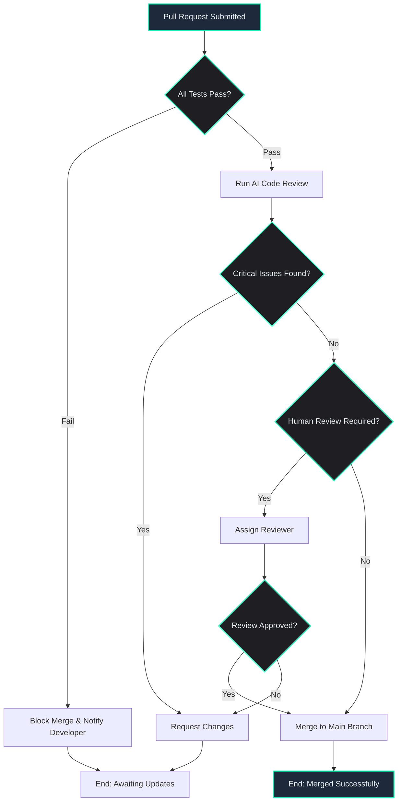
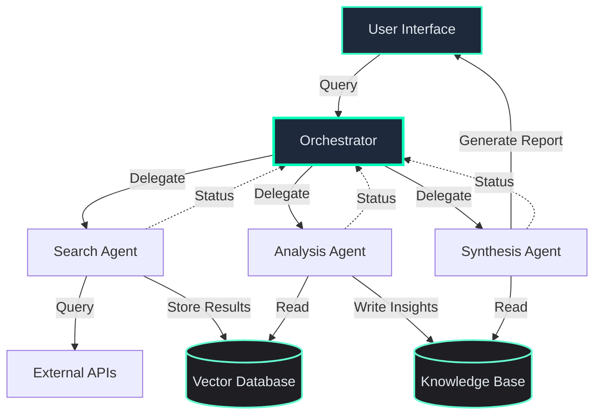

# UX Professional

## Overview

This skill transforms text-heavy educational content into engaging visual experiences by identifying opportunities for data visualization and generating production-ready Chart.js and Mermaid code blocks.

**Core Competencies:**
- Data visualization design and implementation
- Information architecture for learning materials
- Learning effectiveness through visual communication
- Production-ready code generation

**Output:**
- Implementation-ready Chart.js JSON configurations
- Mermaid diagram syntax (flowcharts, sequence diagrams, graphs)
- Sizing, coloring, and layout recommendations
- Accessibility and performance guidelines

**Philosophy:**
Visualizations should enhance learning and understanding, not merely decorate. Every chart or diagram must serve a clear pedagogical purpose: clarifying complex concepts, revealing patterns, or making comparisons more scannable.

## Analysis Workflow

### Step 1: Content Discovery

Accept file path via skill invocation:
```
/ux-professional path/to/file.md
/ux content/week_5/ai-code-review.md
```

**Process:**
1. Read the specified markdown file using the Read tool
2. Parse content structure (headings, sections, subsections)
3. Identify content type:
   - **Tutorial**: Step-by-step instructions, progressive learning
   - **Reference**: Comprehensive documentation, lookup information
   - **Comparison**: Tool/approach evaluations, trade-off analyses
   - **Process**: Workflows, methodologies, decision frameworks

### Step 2: Pattern Recognition

Scan content for visualization triggers. Look for these patterns:

**Quantitative Triggers (Chart.js candidates):**
- Tables with numerical data (percentages, counts, costs, metrics)
- Lists of rankings or comparisons with numbers
- Time-series data (dates, quarters, years, evolution)
- Performance metrics or benchmarks
- Cost analyses or pricing comparisons
- Feature capability scores

**Relational Triggers (Mermaid candidates):**
- Decision logic with if/then/else branches
- Sequential processes with numbered steps
- System architectures with multiple components
- Interaction flows between entities
- Hierarchical relationships
- Workflow descriptions with decision points

**Pattern Examples:**

*Quantitative:*
```markdown
Tool A: 82% accuracy, Tool B: 58% accuracy → Bar chart
Q1: $50k, Q2: $75k, Q3: $90k → Line chart
Features: Speed (8/10), Accuracy (9/10), Cost (6/10) → Radar chart
```

*Relational:*
```markdown
"If code review fails, then retry. Else, deploy." → Flowchart
"Step 1: Initialize. Step 2: Process. Step 3: Validate." → Sequence diagram
"Client sends request to API Gateway which routes to Lambda" → Graph diagram
```

### Step 3: Recommendation Generation

For each identified opportunity:

**Prioritize by learning impact:**
- **High**: Complex concepts that become clear with visualization
- **Medium**: Comparisons or processes that benefit from visual structure
- **Low**: Simple lists that are already scannable

**Consider cognitive load:**
- Maximum 3-4 visualizations per page (avoid overwhelm)
- Place visualizations near related text (reduce split attention)
- Ensure each visualization adds unique value (no redundancy)

**Estimate engagement value:**
- Does it reveal non-obvious patterns?
- Does it make scanning/comparison faster?
- Does it reduce mental effort to understand?

## Visualization Decision Framework

### When to Use Chart.js

**Best for quantitative data patterns:**
- Numerical comparisons across categories
- Trends over time
- Multi-dimensional evaluations
- Performance metrics

**Chart Types:**

**Bar Charts (Horizontal):**
- Rankings or comparisons (5-12 items)
- Tool benchmarks or feature scores
- Percentage-based metrics
- **Triggers**: "vs.", "compared to", "benchmark", "ranking", tables with scores

**Line Charts:**
- Time series data (3+ time points)
- Trends or evolution over periods
- Growth or adoption curves
- **Triggers**: "year", "quarter", "month", "evolution", "trend", "growth"

**Radar Charts:**
- Multi-dimensional comparisons (3-8 dimensions)
- Feature capability matrices
- Balanced scorecard evaluations
- **Triggers**: "features", "capabilities", "dimensions", "factors", comparison tables with 3+ columns

### When to Use Mermaid

**Best for conceptual and relational patterns:**
- Decision trees and workflows
- Sequential processes
- System architectures
- Component relationships

**Diagram Types:**

**Flowcharts:**
- Decision logic with branches
- Workflows with conditional paths
- Algorithm explanations
- **Triggers**: "if/then/else", "decision", "workflow", "choose", "depends on"

**Sequence Diagrams:**
- Process flows with stages
- Interaction patterns
- Step-by-step procedures
- **Triggers**: "step 1-N", "first...then...finally", "sequence", "process"

**Graph Diagrams:**
- System architectures
- Component relationships
- API interactions
- **Triggers**: "client", "server", "API", "component", "service", "architecture"

### Decision Matrix

| Content Type | Best Visualization | Trigger Keywords | Example Use Case |
|--------------|-------------------|------------------|------------------|
| Numerical comparison | Bar/Radar chart | vs., compared to, benchmark | Tool accuracy rankings |
| Time-based evolution | Line chart | year, quarter, month, evolution | Token limit growth over versions |
| Process steps | Flowchart | step 1-N, if/then/else | Code review workflow |
| Architecture | Graph diagram | client, server, API, component | Multi-agent system design |
| Cost analysis | Bar chart | $, cost, pricing, tier | AI service pricing comparison |
| Tool comparison | Radar chart | feature matrix, capabilities | IDE feature comparison |
| Decision tree | Flowchart | choose, depends on, criteria | Prompt engineering strategy selection |

## Code Generation Guidelines

### Chart.js Templates

All Chart.js visualizations use JSON configuration wrapped in ` ```chart ` fence blocks.

#### Bar Chart Pattern (Horizontal)

```chart
{
  "type": "bar",
  "data": {
    "labels": ["Label 1", "Label 2", "Label 3", "Label 4", "Label 5"],
    "datasets": [{
      "label": "Metric Name",
      "data": [85, 72, 68, 54, 42],
      "backgroundColor": [
        "rgba(0, 255, 184, 0.8)",
        "rgba(51, 255, 197, 0.8)",
        "rgba(102, 255, 210, 0.8)",
        "rgba(153, 255, 223, 0.8)",
        "rgba(204, 255, 236, 0.8)"
      ],
      "borderColor": [
        "rgb(0, 255, 184)",
        "rgb(51, 255, 197)",
        "rgb(102, 255, 210)",
        "rgb(153, 255, 223)",
        "rgb(204, 255, 236)"
      ],
      "borderWidth": 2
    }]
  },
  "options": {
    "indexAxis": "y",
    "responsive": true,
    "aspectRatio": 2,
    "plugins": {
      "legend": {
        "display": false
      },
      "title": {
        "display": true,
        "text": "Chart Title Here",
        "font": {
          "size": 16,
          "weight": "bold"
        },
        "color": "#e0e0e0"
      },
      "tooltip": {
        "callbacks": {
          "label": "function(context) { return context.parsed.x + ' units'; }"
        }
      }
    },
    "scales": {
      "x": {
        "beginAtZero": true,
        "title": {
          "display": true,
          "text": "X Axis Label",
          "color": "#e0e0e0"
        },
        "ticks": {
          "color": "#a0a0a0"
        },
        "grid": {
          "color": "rgba(255, 255, 255, 0.1)"
        }
      },
      "y": {
        "ticks": {
          "color": "#e0e0e0"
        },
        "grid": {
          "display": false
        }
      }
    }
  }
}
```

#### Line Chart Pattern

```chart
{
  "type": "line",
  "data": {
    "labels": ["Jan", "Feb", "Mar", "Apr", "May", "Jun"],
    "datasets": [{
      "label": "Metric Over Time",
      "data": [30, 45, 52, 68, 75, 82],
      "backgroundColor": "rgba(0, 255, 184, 0.2)",
      "borderColor": "rgb(0, 255, 184)",
      "borderWidth": 3,
      "pointBackgroundColor": "rgb(0, 255, 184)",
      "pointBorderColor": "#fff",
      "pointBorderWidth": 2,
      "pointRadius": 5,
      "pointHoverRadius": 7,
      "tension": 0.3
    }]
  },
  "options": {
    "responsive": true,
    "aspectRatio": 2,
    "plugins": {
      "legend": {
        "display": true,
        "labels": {
          "color": "#e0e0e0"
        }
      },
      "title": {
        "display": true,
        "text": "Time Series Chart Title",
        "font": {
          "size": 16,
          "weight": "bold"
        },
        "color": "#e0e0e0"
      }
    },
    "scales": {
      "x": {
        "title": {
          "display": true,
          "text": "Time Period",
          "color": "#e0e0e0"
        },
        "ticks": {
          "color": "#a0a0a0"
        },
        "grid": {
          "color": "rgba(255, 255, 255, 0.1)"
        }
      },
      "y": {
        "beginAtZero": true,
        "title": {
          "display": true,
          "text": "Value",
          "color": "#e0e0e0"
        },
        "ticks": {
          "color": "#a0a0a0"
        },
        "grid": {
          "color": "rgba(255, 255, 255, 0.1)"
        }
      }
    }
  }
}
```

#### Radar Chart Pattern

```chart
{
  "type": "radar",
  "data": {
    "labels": ["Feature A", "Feature B", "Feature C", "Feature D", "Feature E"],
    "datasets": [
      {
        "label": "Tool 1",
        "data": [8, 9, 7, 6, 8],
        "backgroundColor": "rgba(0, 255, 184, 0.2)",
        "borderColor": "rgb(0, 255, 184)",
        "borderWidth": 2,
        "pointBackgroundColor": "rgb(0, 255, 184)"
      },
      {
        "label": "Tool 2",
        "data": [6, 7, 9, 8, 5],
        "backgroundColor": "rgba(51, 255, 197, 0.2)",
        "borderColor": "rgb(51, 255, 197)",
        "borderWidth": 2,
        "pointBackgroundColor": "rgb(51, 255, 197)"
      }
    ]
  },
  "options": {
    "responsive": true,
    "aspectRatio": 1.5,
    "plugins": {
      "legend": {
        "display": true,
        "labels": {
          "color": "#e0e0e0"
        }
      },
      "title": {
        "display": true,
        "text": "Multi-Dimensional Comparison",
        "font": {
          "size": 16,
          "weight": "bold"
        },
        "color": "#e0e0e0"
      }
    },
    "scales": {
      "r": {
        "beginAtZero": true,
        "max": 10,
        "ticks": {
          "color": "#a0a0a0",
          "backdropColor": "transparent"
        },
        "grid": {
          "color": "rgba(255, 255, 255, 0.1)"
        },
        "pointLabels": {
          "color": "#e0e0e0",
          "font": {
            "size": 12
          }
        }
      }
    }
  }
}
```

### Mermaid Templates

All Mermaid diagrams use text syntax wrapped in ` ```mermaid ` fence blocks. Dark theme is automatically applied via `mermaid-config.js`.

#### Flowchart Pattern



#### Sequence Diagram Pattern



#### Graph Diagram Pattern



### Key Conventions

**Chart.js:**
- **Orientation**: Horizontal bars (`indexAxis: "y"`) for better label readability
- **Aspect Ratio**: 2:1 for bar/line charts, 1.5:1 for radar charts
- **Colors**: Brand cyan gradient (`#00FFB8` → lighter shades for multiple items)
- **Tooltips**: Always include units (%, $, ms) via callback functions
- **Grid**: Subtle white grids at 10% opacity for depth without distraction
- **Text Color**: `#e0e0e0` for labels/titles, `#a0a0a0` for ticks

**Mermaid:**
- **Theme**: Dark theme auto-applied via config, no manual theme declaration needed
- **Custom Styles**: Use only for emphasis (start/end nodes, decision points)
- **Node Colors**: `fill:#1e293b` (dark slate), `stroke:#00FFB8` (brand cyan)
- **Text Color**: `color:#e2e8f0` (light gray) for contrast
- **Simplicity**: Keep diagrams under 25 nodes to maintain clarity

**Accessibility:**
- **Color Contrast**: Minimum 4.5:1 ratio (WCAG AA) for all text
- **Alternative Descriptions**: Provide caption text before/after visualization
- **No Color-Only Meaning**: Use borders, patterns, or labels in addition to color

## Accessibility & Performance

### Accessibility Guidelines

**WCAG AA Compliance (4.5:1 contrast minimum):**
- Text on dark backgrounds: `#e0e0e0` or lighter
- Brand colors used for borders/fills, not text alone
- Chart tooltips include full context, not just numbers

**Alternative Text:**
- Provide descriptive caption before visualization
- Caption should convey the key insight (e.g., "Greptile leads with 82% bug catch rate, 24 points ahead of the second-place tool")
- For complex diagrams, include text summary of flow/relationships

**Don't Rely Solely on Color:**
```
✓ Good: Bar borders + different fill opacities + data labels
✗ Bad: Only color differences between bars
```

**Screen Reader Considerations:**
- Chart data values in tooltip callbacks are readable
- Mermaid node labels use semantic text (not symbols)
- Provide text-based data table as fallback for complex charts

### Performance Considerations

**Chart Data Limits:**
- **Maximum 50 data points per chart** (performance threshold)
- If dataset > 50 points, recommend pagination or aggregation
- Example: "Monthly data over 10 years = 120 points → Show annual averages (10 points) or add interactive filters"

**Diagram Complexity:**
- **Maximum 25 nodes per Mermaid diagram** (readability threshold)
- If system has > 25 components, recommend:
  - Splitting into multiple diagrams (e.g., "Frontend Architecture" + "Backend Architecture")
  - Grouping related components into subgraphs
  - Creating hierarchical views (overview + detail diagrams)

**Page Load:**
- **Maximum 3-4 visualizations per page** to avoid cognitive overload
- Heavy visualizations (radar charts with multiple datasets) count as 1.5x
- Sequence diagrams with > 10 interactions count as 1.5x

**Mobile Responsiveness:**
- All Chart.js charts use `responsive: true`
- Test horizontal bars at 375px width (iPhone SE)
- Mermaid diagrams may need `transform: scale(0.8)` on mobile (handled by CSS)

### Warning Triggers

**Dataset Size Warning:**
```
⚠️ WARNING: Dataset contains 87 points, exceeding recommended 50-point limit.
RECOMMENDATION: Aggregate data (e.g., weekly → monthly) or implement pagination.
```

**Diagram Complexity Warning:**
```
⚠️ WARNING: Diagram contains 32 nodes, exceeding recommended 25-node limit.
RECOMMENDATION: Split into "System Overview" and "Component Detail" diagrams.
```

**Cognitive Overload Warning:**
```
⚠️ WARNING: Page already has 4 visualizations. Adding more risks cognitive overload.
RECOMMENDATION: Review existing visualizations for consolidation opportunities.
```

## Common Scenarios with Examples

### Scenario 1: Comparison Table → Bar Chart

**Input Content:**
```markdown
### Tool Performance Comparison

| Tool | Bug Catch Rate |
|------|----------------|
| Greptile | 82% |
| Cursor | 58% |
| Copilot | 55% |
| CodeRabbit | 45% |
```

**Recommendation:**
```markdown
### Priority 1: High Impact
**Location:** Section "Tool Performance Comparison" (table with 4 tools)
**Type:** Horizontal Bar Chart
**Rationale:** Visual ranking makes performance gaps immediately scannable. 24-point difference between leader and second place is more striking visually than in table format.

**Implementation:**
```chart
{
  "type": "bar",
  "data": {
    "labels": ["Greptile", "Cursor", "Copilot", "CodeRabbit"],
    "datasets": [{
      "label": "Bug Catch Rate (%)",
      "data": [82, 58, 55, 45],
      "backgroundColor": [
        "rgba(0, 255, 184, 0.8)",
        "rgba(51, 255, 197, 0.8)",
        "rgba(102, 255, 210, 0.8)",
        "rgba(153, 255, 223, 0.8)"
      ],
      "borderColor": [
        "rgb(0, 255, 184)",
        "rgb(51, 255, 197)",
        "rgb(102, 255, 210)",
        "rgb(153, 255, 223)"
      ],
      "borderWidth": 2
    }]
  },
  "options": {
    "indexAxis": "y",
    "responsive": true,
    "aspectRatio": 2,
    "plugins": {
      "legend": {"display": false},
      "title": {
        "display": true,
        "text": "AI Code Review Tool Performance",
        "font": {"size": 16, "weight": "bold"},
        "color": "#e0e0e0"
      },
      "tooltip": {
        "callbacks": {
          "label": "function(context) { return context.parsed.x + '% bugs caught'; }"
        }
      }
    },
    "scales": {
      "x": {
        "beginAtZero": true,
        "max": 100,
        "title": {"display": true, "text": "Bug Catch Rate (%)", "color": "#e0e0e0"},
        "ticks": {"color": "#a0a0a0"},
        "grid": {"color": "rgba(255, 255, 255, 0.1)"}
      },
      "y": {
        "ticks": {"color": "#e0e0e0"},
        "grid": {"display": false}
      }
    }
  }
}
```
```

### Scenario 2: Decision Logic → Flowchart

**Input Content:**
```markdown
### Code Review Workflow

When a pull request is submitted:
1. First, check if all tests pass. If tests fail, block merge and notify developer.
2. If tests pass, run AI code review. If critical issues found, request changes.
3. If no critical issues, check if human review is required (based on file changes).
4. If human review required, assign reviewer and wait for approval.
5. If no human review needed or review approved, merge to main branch.
```

**Recommendation:**
```markdown
### Priority 1: High Impact
**Location:** Section "Code Review Workflow" (5-step conditional process)
**Type:** Flowchart
**Rationale:** Decision branches are complex in text form. Flowchart reveals parallel paths and makes the conditional logic immediately clear.

**Implementation:**

```

### Scenario 3: Time Series Data → Line Chart

**Input Content:**
```markdown
### Token Limit Evolution

GPT-3 (2020): 4,096 tokens
GPT-3.5 (2022): 16,384 tokens
GPT-4 (2023): 128,000 tokens
GPT-4 Turbo (2024): 200,000 tokens
```

**Recommendation:**
```markdown
### Priority 2: Medium Impact
**Location:** Section "Token Limit Evolution" (4 model versions over time)
**Type:** Line Chart
**Rationale:** Growth trend is dramatic (49x increase over 4 years). Line chart emphasizes the acceleration better than a list.

**Implementation:**
```chart
{
  "type": "line",
  "data": {
    "labels": ["GPT-3 (2020)", "GPT-3.5 (2022)", "GPT-4 (2023)", "GPT-4 Turbo (2024)"],
    "datasets": [{
      "label": "Context Window (tokens)",
      "data": [4096, 16384, 128000, 200000],
      "backgroundColor": "rgba(0, 255, 184, 0.2)",
      "borderColor": "rgb(0, 255, 184)",
      "borderWidth": 3,
      "pointBackgroundColor": "rgb(0, 255, 184)",
      "pointBorderColor": "#fff",
      "pointBorderWidth": 2,
      "pointRadius": 6,
      "pointHoverRadius": 8,
      "tension": 0.3
    }]
  },
  "options": {
    "responsive": true,
    "aspectRatio": 2,
    "plugins": {
      "legend": {"display": false},
      "title": {
        "display": true,
        "text": "LLM Context Window Growth (2020-2024)",
        "font": {"size": 16, "weight": "bold"},
        "color": "#e0e0e0"
      },
      "tooltip": {
        "callbacks": {
          "label": "function(context) { return context.parsed.y.toLocaleString() + ' tokens'; }"
        }
      }
    },
    "scales": {
      "x": {
        "title": {"display": true, "text": "Model Version", "color": "#e0e0e0"},
        "ticks": {"color": "#a0a0a0"},
        "grid": {"color": "rgba(255, 255, 255, 0.1)"}
      },
      "y": {
        "beginAtZero": true,
        "title": {"display": true, "text": "Context Window Size (tokens)", "color": "#e0e0e0"},
        "ticks": {
          "color": "#a0a0a0",
          "callback": "function(value) { return value.toLocaleString(); }"
        },
        "grid": {"color": "rgba(255, 255, 255, 0.1)"}
      }
    }
  }
}
```
```

### Scenario 4: System Architecture → Graph Diagram

**Input Content:**
```markdown
### Multi-Agent Research System Architecture

The system consists of several components:
- User Interface sends queries to the Orchestrator
- Orchestrator manages three specialized agents: Search Agent, Analysis Agent, and Synthesis Agent
- Search Agent queries external APIs and stores results in a Vector Database
- Analysis Agent reads from the Vector Database and writes insights to a Knowledge Base
- Synthesis Agent reads from the Knowledge Base and generates reports
- All agents report status back to the Orchestrator
```

**Recommendation:**
```markdown
### Priority 1: High Impact
**Location:** Section "Multi-Agent Research System Architecture"
**Type:** Graph Diagram
**Rationale:** Seven components with complex interactions. Graph reveals the hub-and-spoke pattern (Orchestrator central) and data flow paths that are hard to track in prose.

**Implementation:**

```

## Integration Notes

### High-Priority Opportunities in Course

Based on content structure analysis, these files have strong visualization potential:

**`content/week_5/ai-code-review.md`:**
- Tool comparison tables (lines 200-250) → Radar chart for multi-dimensional feature comparison
- Performance metrics → Already has bar chart, could add trend line if historical data available

**`content/week_6/workflows.md`:**
- CI/CD decision logic → Flowchart for deployment workflow
- Trigger conditions → Flowchart for when to use which automation

**`content/week_6/multi-agent-orchestration.md`:**
- Agent architectures → Graph diagrams showing communication patterns
- Orchestration strategies → Sequence diagrams for coordination flows

**`content/week_5/cost-management.md`:**
- Pricing tiers → Bar chart comparing cost across providers
- Cost optimization strategies → Flowchart for decision tree

**`content/week_1/tokens.md`:**
- Token limits over time → Line chart showing evolution
- Tokenization examples → Could remain text (not high visual value)

### Design Token Usage

Reference existing design system in `/src/styles.css`:

**Cyan Palette (Brand Colors):**
```css
--cyan-8: #00FFB8   /* Primary brand - use for top-ranked items, start/end nodes */
--cyan-9: #33FFC5   /* Secondary - use for second-tier items */
--cyan-10: #66FFD2  /* Tertiary - use for lower-ranked items */
--cyan-11: #99FFDF  /* Quaternary */
--cyan-12: #CCFFEC  /* Lightest - use for lowest-ranked items */
```

**Gray Palette (Text and Backgrounds):**
```css
--gray-1: #111113   /* Chart backgrounds */
--gray-11: #e0e0e0  /* Primary text (labels, titles) */
--gray-10: #a0a0a0  /* Secondary text (ticks, legends) */
```

**Semantic Colors (Use Sparingly):**
```css
--green-9: #22c55e  /* Success states, positive trends */
--yellow-9: #eab308 /* Warning states, caution areas */
--red-9: #ef4444    /* Error states, negative indicators */
```

**Chart.js Color Application:**
```javascript
// For single-dataset bar charts (gradient from brand color)
backgroundColor: [
  "rgba(0, 255, 184, 0.8)",   // var(--cyan-8) at 80% opacity
  "rgba(51, 255, 197, 0.8)",  // var(--cyan-9) at 80% opacity
  "rgba(102, 255, 210, 0.8)", // var(--cyan-10) at 80% opacity
  // Continue pattern...
]

// For line charts (solid brand color with transparency fill)
backgroundColor: "rgba(0, 255, 184, 0.2)",  // Fill under line
borderColor: "rgb(0, 255, 184)"             // Line color
```

## Output Format

### Standard Response Structure

When analyzing a file, provide recommendations in this format:

```markdown
# UX Analysis: [filename]

**Content Type:** [Tutorial/Reference/Comparison/Process]
**Total Sections:** [count]
**Current Visualizations:** [count existing charts/diagrams]

## Visualization Recommendations

### Priority 1: High Impact

**Location:** Section "[Section Name]" (lines [start]-[end] or description)
**Type:** [Chart Type / Diagram Type]
**Rationale:** [Why this visualization adds value - what pattern it reveals or what complexity it simplifies]
**Learning Benefit:** [How this helps students understand the concept better]

**Implementation:**
```chart or ```mermaid
[Full code block ready to paste into markdown]
```

**Caption Suggestion:**
"[1-2 sentence description of key insight this visualization reveals]"

---

### Priority 2: Medium Impact

[Same structure as Priority 1]

---

### Priority 3: Low Priority (Optional Enhancement)

[Same structure as Priority 1]

---

## Summary

**Total Recommendations:** [count]
- High Priority: [count] (implement first for maximum learning impact)
- Medium Priority: [count] (implement after high priority)
- Low Priority: [count] (optional enhancements)

**Cognitive Load Assessment:**
- Current page has [X] visualizations
- Adding [Y] high+medium priority = [X+Y] total
- ✓ Within recommended 3-4 limit / ⚠️ Exceeds recommended limit (consider prioritizing top 3)

**Accessibility Notes:**
- [Any specific accessibility considerations for this content]
- [Color contrast validated / needs adjustment]

**Next Steps:**
1. Review high-priority recommendations with stakeholders
2. Copy code blocks into markdown file
3. Test rendering with `npm run build`
4. Validate mobile responsiveness at 375px width
```

### Minimal Response for Simple Files

If file has limited visualization opportunities:

```markdown
# UX Analysis: [filename]

**Content Type:** [type]
**Current Visualizations:** [count]

## Assessment

This content is primarily [conceptual/textual/already visual] and benefits less from additional data visualization. The existing format (lists, prose, code examples) serves the learning objectives well.

**Possible Low-Priority Enhancements:**
- [Optional suggestion if any, otherwise "None recommended"]

**Rationale:**
[Brief explanation of why visualizations wouldn't add significant value here]
```

## Error Handling

### Common Issues

**Issue: Missing or Incomplete Data**
```
Problem: Table has tool names but no numerical values
Response: Generate placeholder chart with comment:
  // TODO: Add actual performance data for [Tool A], [Tool B], etc.
  // Current values are placeholders for demonstration
```

**Issue: Conflicting Patterns (Multiple Visualization Options)**
```
Problem: Content could work as bar chart OR radar chart
Response: Recommend highest-impact option first, mention alternative:
  "Primary Recommendation: Radar chart (shows multi-dimensional balance better)
   Alternative: Grouped bar chart (simpler, better for mobile)"
```

**Issue: Too Many Visualization Opportunities**
```
Problem: 8+ potential visualizations identified in one file
Response: Prioritize ruthlessly:
  - Rank by learning impact (complex concepts first)
  - Recommend top 3 only
  - Note: "Additional opportunities identified but omitted to avoid cognitive overload"
```

**Issue: Data Quality Concerns**
```
Problem: Numbers in text don't align or seem outdated
Response: Flag in recommendation:
  "⚠️ Data Validation Needed: Table shows conflicting values (82% vs 78% in different sections).
   Verify source before implementing visualization."
```

### Validation Checklist

Before delivering recommendations, validate each visualization:

**Chart.js:**
- [ ] Uses design system colors (cyan gradient)
- [ ] Text color is `#e0e0e0` or `#a0a0a0` (sufficient contrast)
- [ ] Tooltips include units (%, $, ms, etc.)
- [ ] Aspect ratio appropriate (2:1 for bar/line, 1.5:1 for radar)
- [ ] Horizontal bars for rankings (`indexAxis: "y"`)
- [ ] Grid lines at 10% opacity
- [ ] Responsive mode enabled

**Mermaid:**
- [ ] Node count ≤ 25 (readability threshold)
- [ ] Custom styles only on key nodes (start/end/decisions)
- [ ] Node labels are concise (≤ 4 words)
- [ ] Flow direction makes sense (TD for processes, LR for timelines)
- [ ] No redundant connections (keep it clean)

**General:**
- [ ] Caption text provides key insight
- [ ] Placement near related text mentioned
- [ ] No more than 3-4 visualizations total on page
- [ ] Accessibility: 4.5:1 contrast, descriptive labels
- [ ] Mobile responsive considerations noted

## References

### Documentation
- **Chart.js v4 Docs:** https://www.chartjs.org/docs/latest/
- **Mermaid Docs:** https://mermaid.js.org/intro/
- **WCAG 2.1 Guidelines:** https://www.w3.org/WAI/WCAG21/quickref/

### Course Codebase
- **Design System:** `/src/styles.css` (lines 1-86) - Color palette and design tokens
- **Mermaid Config:** `/src/mermaid-config.js` (lines 10-56) - Dark theme configuration
- **Chart Template:** `/src/templates/chart-container.eta` - Chart rendering template
- **Mermaid Template:** `/src/templates/mermaid-container.eta` - Diagram rendering template
- **Build System:** `/src/build-html.ts` (lines 92-148) - Fence block renderer

### Example Implementations
- **Horizontal Bar Chart:** `/content/week_5/ai-code-review.md` (lines 693-775) - Bug catch rates
- **Design Pattern Reference:** `.claude/skills/editor-in-chief/SKILL.md` - Skill structure pattern

### Color Values
```
Brand Cyan: #00FFB8 (rgba(0, 255, 184, 1))
Text Light: #e0e0e0 (rgba(224, 224, 224, 1))
Text Medium: #a0a0a0 (rgba(160, 160, 160, 1))
Grid Lines: rgba(255, 255, 255, 0.1)
Chart Background: #111113 (var(--gray-1))
```
