# Mermaid Diagram Generator — GitHub-Compatible

Generates Mermaid diagrams that render correctly in GitHub Issues, PRs, Discussions, Wikis, and Markdown files.

## GitHub Constraints (MANDATORY)

These rules apply to **all diagrams** generated by this skill:

### 1. Supported Diagram Types Only

GitHub renders a fixed set of Mermaid diagram types. Use only:

| Type | Keyword |
|------|---------|
| Flowchart | `flowchart TD` / `flowchart LR` |
| Graph | `graph TB` / `graph TD` / `graph LR` |
| Sequence | `sequenceDiagram` |
| Class | `classDiagram` |
| State | `stateDiagram-v2` |
| Entity-Relationship | `erDiagram` |
| Gantt | `gantt` |
| Pie | `pie` |
| Git graph | `gitGraph` |
| Mindmap | `mindmap` |
| Quadrant | `quadrantChart` |
| XY Chart | `xychart-beta` |

> Do NOT use diagram types outside this list — they will not render on GitHub.

### 2. Line Breaks in Labels

- **NEVER** use `\n` inside node labels — GitHub's Mermaid parser treats it as a literal escape and breaks parsing.
- **ALWAYS** use `<br/>` for multi-line labels in `graph` and `flowchart` diagrams.

```
✓  CF[CloudFront<br/>Distribution]
✗  CF[CloudFront\nDistribution]   ← parse error on GitHub
```

### 3. Special Characters in Labels

Wrap labels containing special characters (`(`, `)`, `{`, `}`, `"`, `:`) in double quotes:

```
✓  A["POST /api/resource"]
✓  B["User (authenticated)"]
✗  A[POST /api/resource]          ← may break parsing
```

### 4. No Third-Party Init Directives

Avoid `%%{init: {...}}%%` theme overrides — GitHub enforces its own Mermaid version and renderer. Theme overrides may cause parse errors or be silently ignored.

### 5. Label Length

Max 4–5 words per label. Verbose labels cause layout overflow and are harder to read.

---

## Diagram Types

### Flowchart

Best for: decision trees, process flows, algorithm explanations.

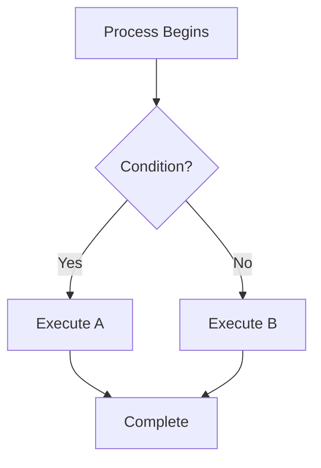

**Directions:** `TD` (top-down), `LR` (left-right), `BT` (bottom-top), `RL` (right-left)

**Node shapes:**
```
[Rectangle]      — standard step
(Rounded)        — process/action
([Stadium])      — start/end
[(Database)]     — cylinder/storage
((Circle))       — connection point
{Diamond}        — decision
{{Hexagon}}      — preparation
[/Parallelogram/] — input/output
```

**Connection types:**
```
-->    solid arrow
---    solid line (no arrow)
-.->   dashed arrow
==>    thick arrow
-->|Label|  labelled arrow
```

### Sequence Diagram

Best for: API interactions, service communication, request/response flows.

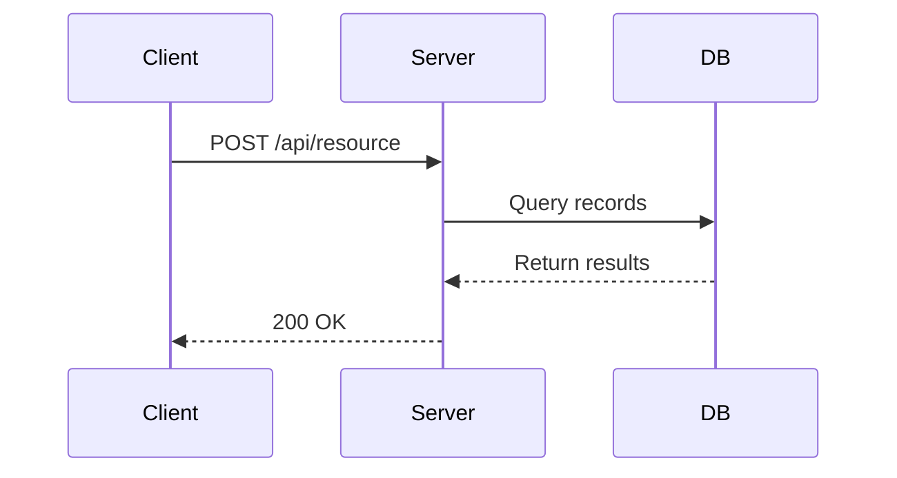

**Arrow types:**
```
->>    solid (request)
-->>   dashed (response)
-x     cross (failed)
-)     async message
```

**Blocks:** `loop`, `alt`/`else`, `opt`, `par`/`and`, `Note over`

### Graph (Architecture / C4)

Best for: system architecture, component relationships, service dependencies.

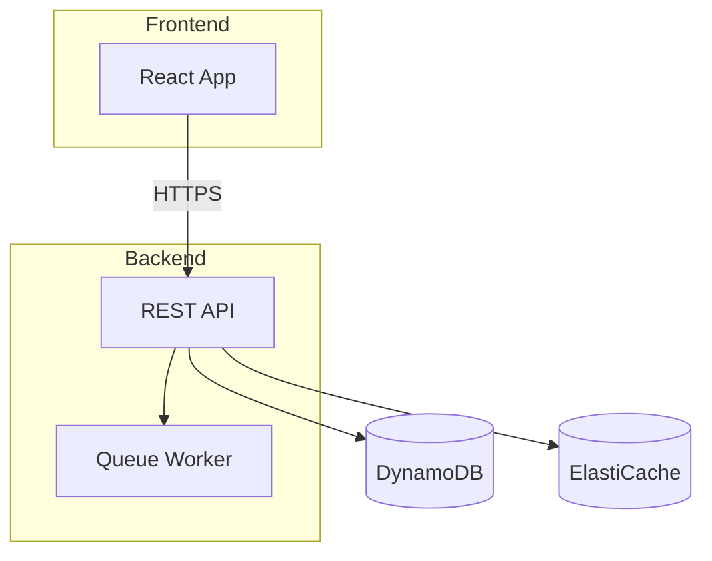

**Critical rules for `graph` / `graph TB` / `graph TD`:**
- Use `<br/>` for multi-line labels — `\n` causes parse errors on GitHub
- Labels: logical names only — no IDs, ARNs, PK/SK patterns, or schema detail
- Show containers/services only — not internal code structure

### Entity-Relationship Diagram

Best for: data models, schema design, entity relationships.

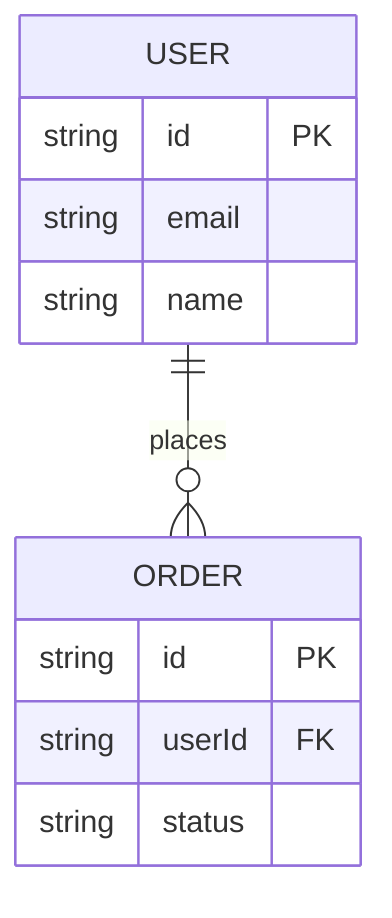

### State Diagram

Best for: state machines, lifecycle flows, status transitions.

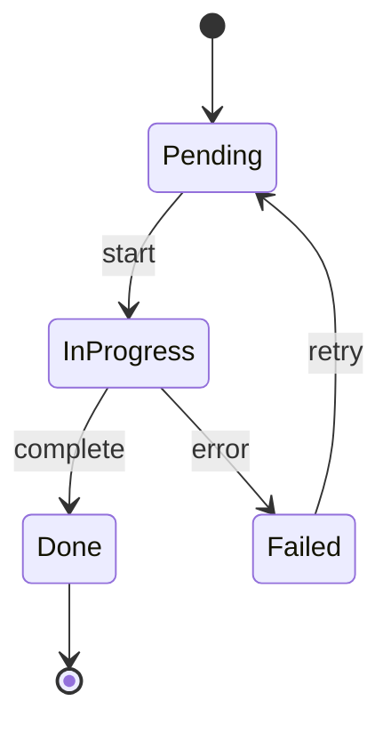

---

## Styling

### Let GitHub Handle Theme

GitHub applies its own Mermaid theme. Do **not** add project-specific inline colors.

**✓ Correct — no inline styles:**
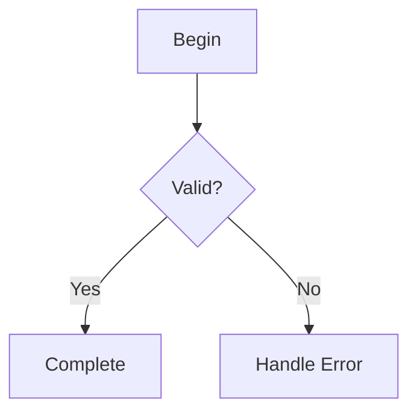

### Emphasis Styling (use sparingly)

Only add inline styles to highlight nodes that must stand out:

```mermaid
flowchart TD
    Normal[Regular Step] --> Critical[Key Decision]
    Critical -->|Fail| ErrorState[Error]
    Critical -->|Pass| Done[Done]

    style Critical stroke-width:3px
    style ErrorState fill:#4a1515,stroke:#ef4444
    style Done fill:#154a15,stroke:#22c55e
```

**Allowed emphasis styles:**
- `stroke-width:3px` — critical/new nodes
- `fill:#4a1515,stroke:#ef4444` — error/failure (red tint)
- `fill:#154a15,stroke:#22c55e` — success/healthy (green tint)
- `fill:#4a4115,stroke:#eab308` — warning (yellow tint)

**Rule:** Style max 3–4 nodes per diagram. Everything else inherits GitHub theme.

---

## Complexity Limits

| Limit | Value |
|-------|-------|
| Max nodes per diagram | 25 |
| Max flowchart depth | 7 levels |
| Max sequence interactions | 10 |

**If diagram exceeds limits:** split into multiple diagrams (overview + detail) or use subgraphs to group.

---

## Workflow

When asked to create a diagram:

1. **Identify type** — flowchart, sequence, graph, ERD, state, or other?
2. **Choose direction** — TD for processes, LR for timelines/pipelines, TB for architecture
3. **Draft structure** — keep under 25 nodes
4. **Apply GitHub constraints** — `<br/>` not `\n`, quote special chars, supported type only
5. **Add emphasis sparingly** — only nodes that need to stand out
6. **Write to file** — `.mmd` extension (e.g., `docs/stories/{id}/design/c4-container.mmd`)

---

## Common Patterns

### Architecture (C4 Container)

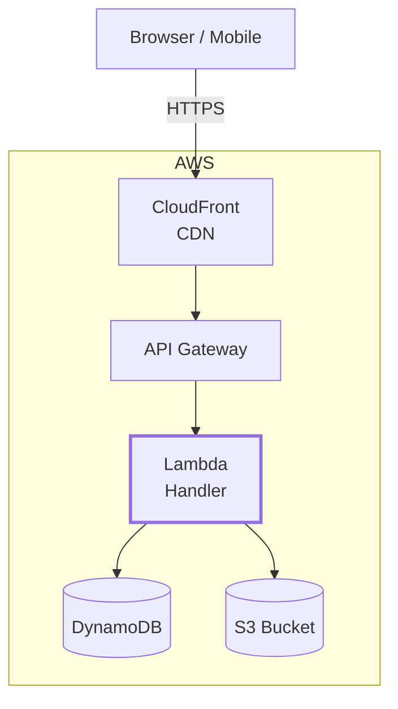

### API Request Flow (Sequence)

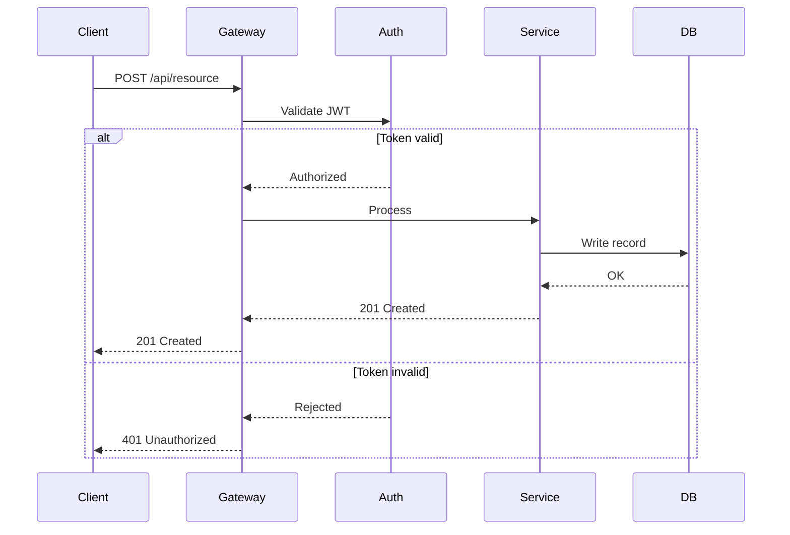

### Business Process Flow

```mermaid
flowchart TD
    Start([User Submits PR]) --> Lint{Lint Pass?}
    Lint -->|No| NotifyDev[Notify Developer]
    Lint -->|Yes| Tests{Tests Pass?}
    Tests -->|No| NotifyDev
    Tests -->|Yes| Review[Request Review]
    Review --> Approved{Approved?}
    Approved -->|No| Changes[Request Changes]
    Approved -->|Yes| Merge[Merge to Main]
    Changes --> Start

    style Lint stroke-width:3px
    style Tests stroke-width:3px
    style NotifyDev fill:#4a1515,stroke:#ef4444
    style Merge fill:#154a15,stroke:#22c55e
```

### Data Model (ERD)

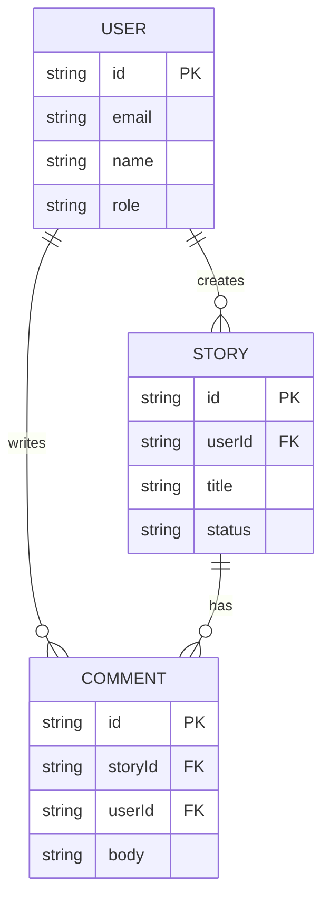

---

## Validation

After generating a diagram, verify:
- [ ] Diagram type is in the GitHub-supported list
- [ ] No `\n` in labels (use `<br/>`)
- [ ] Special chars in labels are quoted with `"`
- [ ] Node count ≤ 25
- [ ] No `%%{init}%%` theme overrides
- [ ] Labels are max 4–5 words
